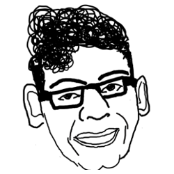

&nbsp;&nbsp;&nbsp;&nbsp;&nbsp;I am a current engineering student at Columbia University. I love math, programming, music, and above all, learning. I'm always open to working on new projects and optimizing old ones. Feel free to reach out and connect with me (sb3436@columbia.edu) if you'd like to collaborate, learn more about me, or even just chat! I currently live in Manhattan most of the year but spend some time in Chicago as well.
